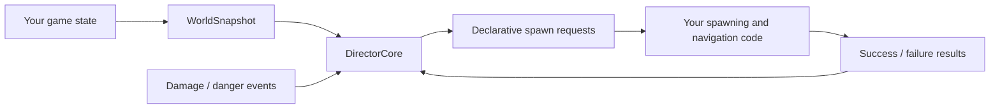
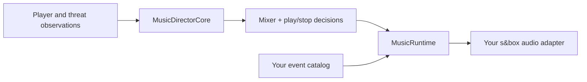

# Adaptive Director for s&box

A generalized, deterministic pacing and encounter-orchestration library inspired by the architecture of Left 4 Dead 2's Director. It does not contain Valve code. Its clean-room core consumes plain snapshots and emits spawn requests, leaving entities, navigation, networking, and game rules to your game.

Repository: https://github.com/zeljkovranjes/sbox-adaptive-director

Documentation: [getting started](docs/GETTING_STARTED.md) · [architecture](docs/ARCHITECTURE.md) · [API map](docs/API.md) · [adaptive music](docs/MUSIC.md) · [tuning](docs/TUNING.md) · [L4D2 evidence map](docs/EVIDENCE.md)

Current release: **1.4.0**. See the [changelog](CHANGELOG.md).

## How it fits



The library separates pressure, tempo, concurrent encounter lanes, population reservations, composition/retry, spatial placement, resource density, scenario/wave orchestration, adaptive music, and game-specific policy. Because the core knows nothing about concrete NPC classes, audio assets, or s&box navigation, the same Director can run in survival rounds, a continuous campaign, extraction, an arena, or a custom mode.

Adaptive music follows the same engine-independent boundary:



`MusicDirectorCore` contains the recovered continuous envelopes and generalized
combat, special, boss, dormant-hazard, mob, atmosphere, scenario, and positional
rules. `MusicRuntime` contains priority, blocking, ducking, stop lists, fades,
delays, timing-tag synchronization, autoqueue, and death/scenario lifecycle gates.
Both sides are deterministic and independently saveable. A network game replicates
`MusicDecisionBatch` to the owning client; a local game can use
`MusicDirectorHostRunner` directly.

## Minimal integration

```csharp
var director = new DirectorCore( new DirectorConfiguration { Seed = 1234 } );

// Call when your game reports danger. You decide how game events map to severity.
director.ApplyPressure( new PressureEvent( playerId, PressureSeverity.Major, "heavy_damage" ), gameTime );

// Build this from your own players, NPC counts, and candidate spawn locations.
var decisions = director.Tick( snapshot );
foreach ( var request in decisions.SpawnRequests )
{
	var spawned = TrySpawnInYourGame( request );
	director.ApplyResult( new SpawnRequestResult(
		request.RequestId,
		spawned == request.RequestedCount ? RequestResultKind.Succeeded : RequestResultKind.PartiallySucceeded,
		spawned ) );
}
```

For a round game, create or reset one `DirectorCore` when a round begins and stop ticking it when the round ends. `RoundSessionFlow` is an optional small adapter. For a game without rounds, keep one core alive and use `ContinuousSessionFlow`; neither adapter is required by the algorithm.

Customize `IDirectorPolicy` to choose your own archetypes and coexistence rules. Customize `IEncounterSchedule` to decide when to request ambient enemies, waves, specials, bosses, objectives, or custom encounters. `ScenarioController` and `WaveSequenceController` are optional building blocks for scripted sequences.

For deeper modes, compose independent lanes with `ConcurrentEncounterSchedule`, build groups with `UniformEncounterComposer` or the optional `WeightedEncounterComposer`, integrate panic/finale-style flow with `DirectorOrchestration`, and populate items through `ResourcePopulationController`. See the [advanced compilable example](examples/AdvancedDirectorExample.cs).

The [example index](examples/README.md) also covers minimal manual ticking, custom
game policy, combined round/music integration, networked music authority and
clients, catalog arbitration, timing tags, and saving every subsystem together.

For recovered compatibility behavior, use `RecoveredDirectorDefaults.CreateThreatAreaProfile()` for random-transposition/first-valid area selection and `CreateRouteStepProfile()` for greatest-flow/first-tie selection. `HullVisibilitySamples` builds the recovered five trace points. `SpecialClassRotation` exposes the independent due/eligibility timers and `UniformEncounterComposer` supplies equal class choice. Your host still supplies navigation connections, visibility results, candidate attributes, and successful lifecycle callbacks.

For adaptive music, start with `RecoveredMusicDirectorDefaults`, define a
`MusicEventCatalog` using your own event and track IDs, and translate
`MusicRuntimeAction` into your audio system. See the
[compilable music example](examples/MusicDirectorExample.cs) and
[music integration guide](docs/GETTING_STARTED.md#adaptive-music).

`DirectorStateCodec` provides encounter-system JSON save/load. `MusicStateCodec`
does the same for authoritative music envelopes/timers/RNG and client active
tracks/queues/duck state. Stateful built-in schedules, pressure trackers, RNG
state, tempo timers, request identifiers, and pending population reservations are
restored deterministically. `DirectorHostRunner` enforces the active-session and
authority boundaries and converts host spawn exceptions into failed results.

## Verification

- Fast deterministic suite: `dotnet run --project dev/SboxDirector.Tests/SboxDirector.Tests.csproj`
- Real editor gate: `powershell -ExecutionPolicy Bypass -File dev/editor-rig/run_editor_gate.ps1 -Clean`
- Everything: `powershell -ExecutionPolicy Bypass -File dev/run_all.ps1 -CleanEditor`

## Research

The full evidence is published separately in [l4d2-director-system-research](https://github.com/zeljkovranjes/l4d2-director-system-research). The local `research/` and `tools/` directories remain Git-ignored so bulky analysis artifacts are not shipped with the runtime library. See [EVIDENCE.md](docs/EVIDENCE.md) for component-to-RVA traceability and clean-room boundaries.
