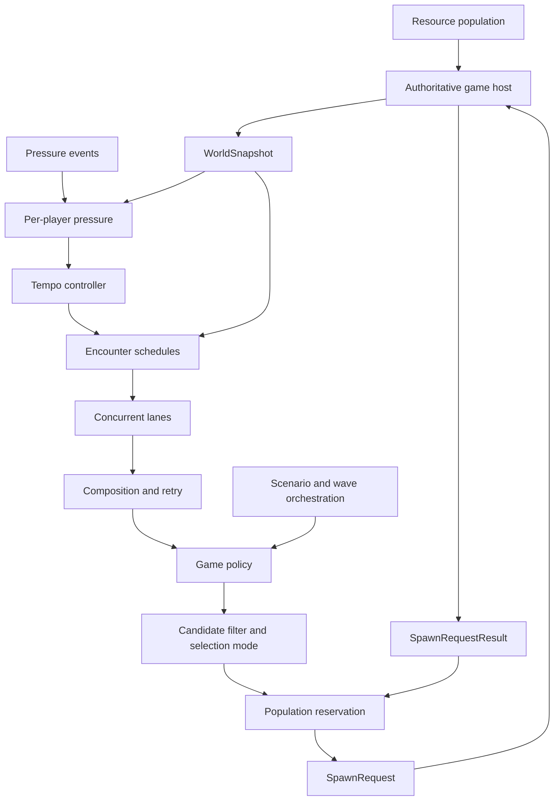
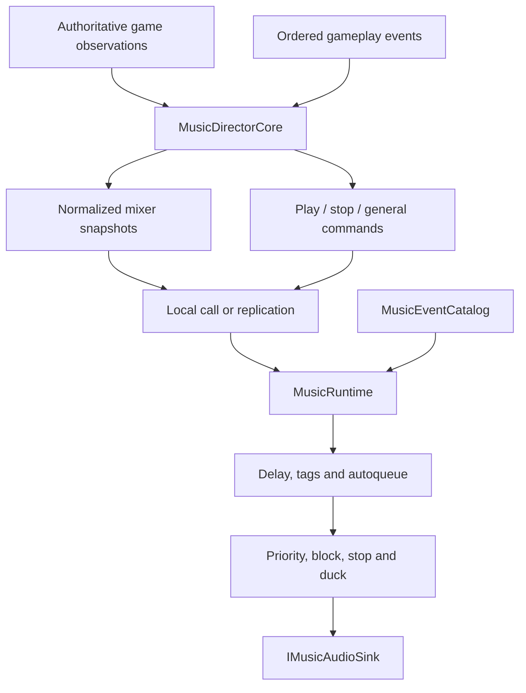

# Architecture

Adaptive Director is a deterministic decision engine. It never searches s&box scenes, creates entities, or owns game rules. The host translates game state into immutable snapshots and executes declarative requests.

Tick order is stable: expire abandoned requests, update eligible-player pressure, transition tempo, evaluate resources and orchestration, service due retries, query independent schedules, apply policy, select a placement candidate, compose the encounter, reserve population, then emit requests. The host reports each outcome. `Deferred` keeps its reservation; final failures release it and may enter the bounded retry queue. Scenario and wave progression waits for the corresponding host result, and its retry may run even while ordinary scheduling is suppressed.

Placement has four explicit modes. `WeightedScore` is the general clean-room policy. `FirstEligible`, `HighestProgressFirstTie`, and `NativeRandomTranspositionFirst` make ordering semantics visible and allow recovered compatibility. The last mode reproduces the native full-range swap loop, which differs from Fisher-Yates. `RecoveredDirectorDefaults` packages the proven dimensions and selection presets without making the core depend on a particular navigation engine.

The four tempo phases are `Relax → BuildUp → SustainPeak → PeakFade → Relax`. This preserves the recovered pacing contract while every duration and threshold remains configurable.

The core is engine-neutral. `AdaptiveDirectorComponent` is the optional s&box bridge. Derive from it when a component lifecycle is convenient, or use `DirectorHostRunner` from an existing game manager.

## Adaptive music boundary

Authority tick order is stable: exact-once ordered events, stable participant scan,
envelope update, continuous-layer emission, then combat/mob/boss/hazard/special/
atmosphere/positional transitions. Runtime order is resolve, lifecycle gate, block
gate, delay/tag scheduling, stop-list application, priority arbitration, engagement,
and duck recomputation. Neither side reads a wall clock or engine singleton.

The recovered compatibility preset carries numeric control behavior, not original
audio names or assets. Hosts map their own event IDs and can disable any rule by
leaving its cue empty. Round games can reset or reconstruct the music core per
round; continuous games persist it. Network games keep `MusicDirectorCore` on the
authority and one `MusicRuntime` per listener/client.
