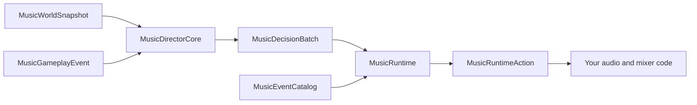

# Adaptive music

The music subsystem has two parts because game authority and audio playback often
live in different places.



- `MusicDirectorCore` observes gameplay and decides what should happen.
- `MusicRuntime` decides how authored tracks interact and tells the host what to do
  to its audio system.

Neither class calls s&box audio APIs. This makes both classes deterministic,
testable, saveable, and usable with any audio middleware.

## Minimal setup

```csharp
var cues = new MusicCueConfiguration
{
    CombatIntroEvents = new[] { "game.combat_intro" },
    CombatSecondaryEvent = "game.combat_secondary",
    CombatCloseEvent = "game.combat_close",
    BossApproachingEvent = "game.boss",
    BossTrackId = "boss"
};

var authority = new MusicDirectorCore(
    RecoveredMusicDirectorDefaults.CreateConfiguration(cues, seed: 123));

var catalog = new MusicEventCatalog(new[]
{
    new MusicEventDefinition
    {
        EventId = "game.combat_intro",
        TrackId = "combat",
        Priority = MusicPriority.Critical
    },
    new MusicEventDefinition
    {
        EventId = "game.boss",
        TrackId = "boss",
        Priority = MusicPriority.Critical,
        BlockTrackList = new[] { "combat" }
    }
});

var runtime = new MusicRuntime("player-1", catalog);
var decisions = authority.Tick(world);
var audioWork = runtime.Apply(decisions);
foreach (var action in audioWork.Actions)
    ApplyToYourAudioSystem(action);
```

The complete compiling version is [MusicDirectorExample.cs](../examples/MusicDirectorExample.cs).

## World observations

Create one `MusicParticipantSnapshot` for each listener. Important inputs are:

| Input | Meaning |
|---|---|
| `CumulativeDamage` | monotonic damage counter; the core detects new damage |
| `WeaponActivity` | normalized current firing/activity signal |
| `InflictedDamage` | one-tick damage-inflicted pulse |
| `VisibleCommonThreats` | visible ordinary-threat count |
| `AttackingCommonFactor` | normalized attacking pressure |
| `CloseCommonAction` | normalized close-range action |
| `VeryCloseCommonFactor` | normalized very-close pressure |
| `BossPresent` | generalized live boss gate |
| `Hazard*` | dormant-hazard burning, attack, position and rage state |
| `SpecialThreats` | archetype, distance and optional position for alert rules |
| `WanderingHazards` | candidates with anger values for the four-tier rule |
| `PositionalCandidates` | eligible emitters for randomized positional stingers |

Values described as normalized must be in `[0,1]`. Participant IDs, archetype IDs,
emitter IDs, and candidate order must be stable. The core sorts all externally
unordered inputs before selection.

## Continuous layers

`MusicMixerLayers` defines generalized layer IDs for mob beating, mob rules,
hazard rage, combat, secondary combat, close combat, adrenaline, checkpoint, and ambient
volume. `SetMixerLayer` is an idempotent snapshot: applying the latest value is
enough, even if an earlier packet was lost.

The compatibility preset uses the recovered remaps and envelope defaults. All
rates, decays, thresholds, counts, BPM values, and beat counts remain configurable
under `DynamicMusicConfiguration`.

## Discrete gameplay hooks

Use increasing sequence IDs in `MusicGameplayEvent`. Re-sending an already consumed
sequence is harmless. Built-in kinds cover play, stop event, stop track, stop all,
general command, reset, scenario end, player restoration, ambient mob, default or
behind mob spawn, rate-limited large-area reveal, and caller-supplied landmark
reveal. Any game-specific round, objective, or stage cue can use `Play` with its own
catalog event ID.

## Catalog arbitration

Each `MusicEventDefinition` can configure:

- a stable event and track ID;
- `Low`, `Medium`, `High`, or `Critical` priority;
- block, duck, and stop track lists (`all` is supported);
- default fade and delayed start;
- `PlayToEnd`, `PlaySplit`, `DontDisengage`, and `DontEngage` behavior;
- permission after participant death or scenario completion;
- an automatic successor event;
- master timing tags, loop duration, incoming sync track/tag, tag delay, and delay
  multiplier.

The runtime returns a result for every authority decision: accepted, deferred,
unknown, blocked, lifecycle-rejected, priority-rejected, or adapter failure. Audio
completion is explicit: call `ReportCompleted(instanceId, time)` so an autoqueued
successor can engage.

## Local, round, and network games

- Local/single player: use `MusicDirectorHostRunner` or derive
  `AdaptiveMusicDirectorComponent`.
- Continuous server game: retain the core and save it with the world.
- Round game: create/reset one core per round, or keep it and send `Reset` at your
  chosen boundary.
- Network game: run `MusicDirectorCore` on authority, replicate semantic decisions,
  and run one `MusicRuntime` on each owning client. Do not replicate audio handles.

For different per-player experiences, the authority emits decisions with a
participant ID and each runtime ignores decisions for other participants.

## Save and restore

```csharp
var authorityJson = MusicStateCodec.DirectorToJson(authority.CaptureState());
var runtimeJson = MusicStateCodec.RuntimeToJson(runtime.CaptureState());

authority = new MusicDirectorCore(config,
    MusicStateCodec.DirectorFromJson(authorityJson));
runtime = new MusicRuntime("player-1", catalog,
    MusicStateCodec.RuntimeFromJson(runtimeJson));
```

Authority state includes every envelope, transition flag, cooldown, RNG value,
last event sequence, decision ID, and mixer snapshot. Runtime state includes active
and queued events, lifecycle flags, mixer layers, track volumes, and action/instance
IDs. Restoration rejects version, participant, or catalog mismatches.

## Evidence boundary

The recovered server/client equations, timers, event rules, command meanings, and
metadata grammar are documented in the
[research report](https://github.com/zeljkovranjes/l4d2-director-system-research/blob/main/research/MUSIC_DIRECTOR_RECOVERY.md).
This library contains no Valve source, event scripts, sounds, or assets. Generalized
IDs, public APIs, persistence, adapter actions, and underdetermined same-track tie
policy are clean-room engineering.
