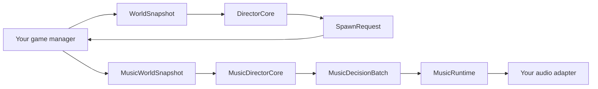

# Example index

All `.cs` examples in this directory are compiled by the verification pipeline.
Replace example archetype, event, track, and mode IDs with IDs from your game.

| If you need to... | Start here |
|---|---|
| Tick the Director manually from an existing manager | [`MinimalManualDirectorExample.cs`](MinimalManualDirectorExample.cs) |
| Report damage, incapacitation, ledges, revivals and nearby threat deaths | [`PressureReportingExample.cs`](PressureReportingExample.cs) |
| Run continuously and save/restore | [`ContinuousExample.cs`](ContinuousExample.cs) |
| Integrate with an existing round manager | [`RoundBasedExample.cs`](RoundBasedExample.cs) |
| Use the Director and optional Music Director in one round system | [`RoundDirectorAndMusicExample.cs`](RoundDirectorAndMusicExample.cs) |
| Define custom enemies, boss/hazard coexistence and difficulty rules | [`CustomGamePolicyExample.cs`](CustomGamePolicyExample.cs) |
| Combine schedules, composition, resources and scenario stages | [`AdvancedDirectorExample.cs`](AdvancedDirectorExample.cs) |
| Run adaptive music locally | [`MusicDirectorExample.cs`](MusicDirectorExample.cs) |
| Build a complete reusable music catalog | [`ExampleMusicSetup.cs`](ExampleMusicSetup.cs) |
| Test priority, ducking, blocking, timing tags and death cues | [`MusicCatalogFeaturesExample.cs`](MusicCatalogFeaturesExample.cs) |
| Split music authority and playback across the network | [`NetworkedMusicExample.cs`](NetworkedMusicExample.cs) |
| Save the Director, music authority and music runtime together | [`SaveRestoreEverythingExample.cs`](SaveRestoreEverythingExample.cs) |

## Common integration pattern

The encounter Director and Music Director are independent. Use either one by
itself, use both, or enable music only in selected modes.

## Reporting pressure

Create one `PressureReportingExample` around either `DirectorCore.ApplyPressure` or
`DirectorHostRunner.ReportPressure`. Report a gameplay event once, at its
authoritative monotonic game time. Do not report the same damage from both client
prediction and server confirmation.

The example reproduces the compatibility damage bands and high-value events, but
the mapping belongs to your game. A racing game might report collisions and being
overtaken; a stealth game might report detection and pursuit; a survival game might
report damage, incapacitation, isolation and nearby boss activity.

## Host responsibilities

The examples deliberately leave these parts to the game:

- building navigation/spawn candidates;
- creating and destroying actual entities;
- reporting final spawn counts;
- mapping gameplay events to pressure severity;
- mapping music observations to normalized values;
- replicating semantic music decisions when authority and audio are separate;
- translating `MusicRuntimeAction` into s&box or middleware audio calls.

Keeping those responsibilities outside the library is what makes the same Director
usable in campaigns, rounds, arenas, extraction games and custom scripted modes.
